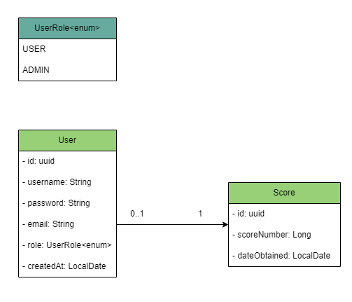
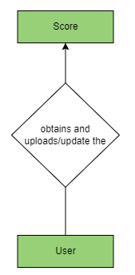

# ProyectoFinalDAM_MarioResa
Proyecto final de Desarrollo de Aplicaciones Multiplataforma del curso 22/23. IES Luis Vives.

## Índice

- [Introducción](#introducción)
- [Diseño](#diseño)
- [Funcionamiento de la Aplicación](#funcionamiento-de-la-aplicación)
- [Autor](#autor)

## Introducción
El gran proyecto es un videojuego con capacidades competitivas online (sin ser multijugador) usando una tabla de puntuaciones que cualquier usuario registrado pueda ver dentro de este.

Este proyecto se encuentra formado por dos partes, clásicas en un desarrollo de software, backend y frontend.

¿Y... el nombre elegido? **¡Sp4ce Survival!**

Se basará en un bullet hell orientado a la supervivencia del jugador donde su principal objetivo será obtener la mayor puntuación posible.

## Diseño

### [Diagramas](diagrams)

#### Diagrama de Clases

Se observan dos elementos principales del proyecto, *Usuario* y *Puntuación*.

La relación es sencilla, un usuario puede no tener una puntuación asociada, o **una** como **máximo**.

Además, exiten **dos** roles para los usuarios:

- USER
- ADMIN

#### Diagrama de Entidad-Relación

Un usuario obtiene una puntuación y la puede almacenar/actualizar.

## Funcionamiento de la Aplicación

Realmente ambas partes son elementos individuales que forman parte de algo mayor; el videojuego podrá ser disfrutado de manera individual debido a que se ofrece soporte offline.

Pero, dejando eso de lado, la ejecución del programa seguiría el siguiente orden, a lo que posibles **menús** pueda acceder el usuario: 

### Menú de bienvenida

El usuario podría iniciar sesión, registrarse o jugar offline; si decidió jugar online, y una vez verificada la acción realizada con el backend, este pasaría al menú principal.

Además, cuenta con el menú de opciones y la posibilidad de cerrar la aplicación.

### Menú principal

El usuario podrá jugar, con la capacidad de elegir un nivel de dificultad; ver su perfil y ver una tabla de puntuaciones.

Además, cuenta con el menú de opciones y la posibilidad de cerrar la aplicación (además, si la última vez que salió se encontraba en modo online, se realizará una comprobación del estado de la cuenta y si todo es correcto, se pasará automáticamente a este menú sin pasar por el de bienvenida, si no, el estado online se pasará a offline y se dejará al usuario en el menú de bienvenida).

### Menú de perfil - [Solo Online]

[Coming Soon]

### Menú tabla de puntuaciones - [Solo Online]

[Coming Soon]

### Menú de opciones

Es un sencillo menú que permite ajustar ciertos valores del juego y es accesible desde tres localizaciones diferentes:
- Menú de bienvenida
- Menú principal
- Menú de pausa en el nivel jugable

## Autor

[Mario Resa](https://github.com/Mario999X)

